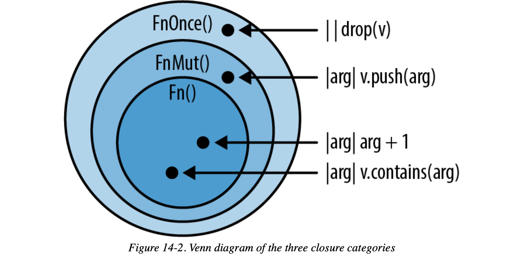

## Closure

Rust 中的闭包 (Closure ,  `['kloʊʒər]` ) 是一种匿名函数，它可以赋值给变量也可以作为参数传递给其它函数，不同于函数的是，它**允许捕获调用者作用域中的值** ：

```rust
fn main() {
   let x = 1;
   let sum = |y| x + y;  // 捕获x

    assert_eq!(3, sum(2));
}
```

**严格定义**:  闭包是将函数，或者说代码和其环境一起存储的一种数据结构。闭包引用的上下文中的自由变量，会被捕获到闭包的结构中，成为闭包类型的一部分

```rust
|param1, param2,...| {  // 闭包的定义以一对竖线 ` || ` 开始，在竖线中指定闭包参数
    语句1; 语句2;        // 闭包体, 如果只有一行代码, 则大括号可以省略
    返回表达式 
}
```


### Long Story: Why need Closure

Why need it？ 闭包在函数式编程中的重要性: 

 - **状态捕获**

```rust
// 命令式编程
let mut count = 0;
fn increment_count(count: &mut i32) { 
    *count += 1; 
}

// 函数式:
fn main(){
	let mut count = 0;
	let mut increment_count = || {
	    count += 1;
	};
	increment_count();
}
```


 - **控制流抽象**

```rust
// 循环:
let numbers = vec![1, 2, 3, 4, 5, 6];
let mut divisible_by_three = None;
for &num in &numbers {
    if num % 3 == 0 {
        divisible_by_three = Some(num);
        break;
    }
}
println!("{:?}", divisible_by_three); // Some(3)

// 函数式:
fn main(){
    let numbers = vec![1, 2, 3, 4, 5, 6];
    let divisible_by_three: Vec<_> = numbers.iter().filter(|&x| x % 3 == 0).collect();
    println!("{:?}", divisible_by_three);
}
```


 - **高阶函数**：map、collect、filter


想象一下，我们要进行健身，用代码怎么实现？

```rust
use std::thread;
use std::time::Duration;

// 开始健身，每次健身, 为了显示你的存在感, 你都会大吼: "吼吼哈嘿!!!"
fn roarrrrrrrr(intensity: u32) -> u32 {
    println!("吼吼哈嘿!!!");
    thread::sleep(Duration::from_secs(2));  // 线程阻塞(休眠) 2s
    intensity
}

fn workout(intensity: u32, random_number: u32) {
    if random_number > 3 {
        println!("今天活力满满，先做 {} 个俯卧撑!",
            roarrrrrrrr(intensity)
        );
    } else if random_number == 3 {
        println!("昨天练过度了，今天练 {} 组就回家！",
            roarrrrrrrr(intensity)
        );
    } else {
        println!("昨天练过度了，今天有氧，跑步 {} 分钟!",
            roarrrrrrrr(intensity)
        );
    }
}

fn main() {
    let intensity = 200;     // 健身强度, 比如 10 个俯卧撑
    let random_number = 7;   // 随机值用来决定某个选择

    // 开始健身
    workout(intensity, random_number);
}
/*  执行结果:
吼吼哈嘿!!!
活力满满，先做 200 个俯卧撑!
*/
```

可以看到，每次健身前, 我们都会调用 **`roarrrrrrrr`** 给自己加油打气后, 再开始健身。这个程序本身很简单也不重要，没啥好说的

但是，假如未来我们变得内向安静内敛沉默寡言，不再 `roarrrrrrrr` 大喊大叫了，是不是得把所有 `roarrrrrrrr` 都替换掉，比如说替换成 `breathhhhh` ？如果 `roarrrrrrrr` 出现了几十次，那意味着我们**要修改几十处代码**。


一个可行的办法是，把**函数赋值给一个变量**，然后通过变量调用：

```rust
    let action = roarrrrrrrr;         // here
    if random_number > 3 {
        println!("活力满满! 先做 {} 个俯卧撑!",
            action(intensity)         // here
        );
    } else if random_number == 3 {
        println!("昨天练过度了，今天练 {} 组就回家！",
            action(intensity)         // here
        );
    } else {
        println!("昨天练过度了，今天有氧，跑步 {} 分钟!",
            action(intensity)         // here
        );
    }
```

经过上面修改后，**所有的调用都通过 `action` 来完成**，若未来动作变了，不喊了，改成深呼吸，只要修改为 `let action = breathhhhh` 即可。

但是问题又来了，若 `intensity` 也变了怎么办？例如变成 `action(intensity + 1)`，那你又要哐哐哐修改几十处代码调用。

**该怎么办？没太好的办法了，只能祭出大杀器：闭包**。

上面提到 `intensity` 的变化我们可以使用闭包来捕获 ：

```rust
use std::thread;
use std::time::Duration;

fn workout(intensity: u32, random_number: u32) {

    let action = || {
        println!("深呼吸....");
        thread::sleep(Duration::from_secs(2));
        intensity
    };

    if random_number > 3 {
        println!("今天活力满满，先做 {} 个俯卧撑!",
            action()
        );
    } else if random_number == 3 {
        println!("昨天练过度了，今天练 {} 组就回家",
            action()
        );
    } else {
        println!("昨天练过度了，今天有氧，跑步 {} 分钟!",
            action()
        );
    }
}
fn main() {
    let intensity = 200;     // 健身强度, 比如 10 个俯卧撑
    let random_number = 3;  // 随机值用来决定某个选择

    // 开始健身
    workout(intensity, random_number);
}
/*  执行结果:
深呼吸....
昨天练过度了，今天练 200 组就回家
*/
```

可以看到, 使用函数式编程的闭包后, 一切修改都变得容易起来, 即使昨天训练过度, 今天依然能做 200 组


###type inference

- 函数：必须手动为函数的所有参数和返回值指定类型
- **闭包并不会作为 API 对外提供，因此它可以享受编译器的类型推导能力，无需标注参数和返回值的类型**。

```rust
let sum = |x: i32, y: i32| -> i32 {
    x + y
}

let sum  = |x, y| x + y; 

let v = sum(1, 2);
```


虽然类型推导很好用，但是它不是泛型，**当编译器推导出一种类型后，它就会一直使用该类型**：

```rust
#![allow(unused)]
fn main() {
	let example_closure = |x| x;
	
	let s = example_closure(String::from("hello"));  // 为 x 推导出类型 `String`
	let n = example_closure(5);    //报错： `n` 试图用 `5` 这个整型去调用闭包
}
```

首先，在 `s` 中，编译器为 `x` 推导出类型 `String`，但是紧接着 `n` 试图用 `5` 这个整型去调用闭包，跟编译器之前推导的 `String` 类型不符，因此报错


### Size of Closure

在官方的 Rust reference 中，有这样的定义：

> A closure expression produces a closure value with a unique, anonymous type that cannot be written out. A closure type is approximately equivalent to a struct which contains the captured variables.
>
> 闭包表达式生成一个闭包值，该值具有无法写出的唯一匿名类型。 闭包类型大致等同于包含捕获变量的结构。**这个结构就像一个 struct，会包含所有捕获的变量**。

所以闭包类似一个特殊的结构体 struct？

为了搞明白这一点，我们得写段代码探索一下，下面的代码创建了一系列变量, 并 `size_of_val()` 查看其 `size of the pointed-to value in bytes.`

```rust
use std::{collections::HashMap, mem::size_of_val};
fn main() {
    let c1 = || println!("hello world!");    // 长度为 0
    let c2 = |i: i32| println!("hello: {}", i); // // 和参数无关，长度也为 0
    
    // 如果捕获一个引用，长度为 8 (引用的大小都是 8 字节)
    let name = String::from("tyrrrr");       // 指向 String 的栈上的胖指针(ptr/len/cap)
    println!("fat pointer: {}", size_of_val(&name));  // fat pointer: 24
    let c3 = || println!("hello: {}", name); // 8 闭包内部对 name 是以不可变引用的方式使用的

    // 捕获移动的数据 name1(长度 24) + table(长度 48)，closure 长度 72
    let name1 = name.clone();  // 深拷贝(堆 + 栈都 copy)
    let mut table = HashMap::new();
    table.insert("hello", "world");
    let c4 = move || println!("hello: {}, {:?}", name1, table);
    
    
    // 和局部变量 name3 无关，捕获了一个 String name2，closure 长度 24
    let name2 = name.clone();
    let c5 = move || {
        let x = 1;
        let name3 = String::from("lindsey");
        println!("hello: {}, {:?}, {:?}", x, name2, name3);
    };
    // println!("name2:{}", name2); // Error: borrow of moved value: `name2`

    println!(
        "c1: {}, c2: {}, c3: {}, c4: {}, c5: {}, main: {}",
        size_of_val(&c1),
        size_of_val(&c2),
        size_of_val(&c3),
        size_of_val(&c4),
        size_of_val(&c5),
        size_of_val(&main),
    )
    /**/ c1: 0, c2: 0, c3: 8, c4: 72, c5: 24,  main: 0
}
```

>  `mem::size_of_val` 是 Rust 语言标准库中的一个函数，它的作用是获取一个值的内存大小，即它在内存中占用的字节数（1 字节=8 bits）。
>
>   `std::mem::size_of_val()` 函数返回的是变量在栈上占用的空间大小，对于 `String` 或 `Vec<T>` 这类在堆上分配的类型，`size_of_val()` 只会返回其在栈上的元信息（指针(8字节)、长度(8字节)和容量(8字节)的大小，而不包括其在堆上分配的数据。


上述代码分别生成了 5 个闭包：

- c1 没有参数，也没捕获任何变量，c1 长度为` 0`； 
- c2 虽有一个` i32 ` 作为参数，没有捕获任何变量，长度也为 `0`，可以看出 **闭包的大小跟闭包参数无关**；
- c3 捕获了一个对变量 `name` 的引用，这个引用是` &String`，长度为 8。  闭包 `c3` 的长度正好也是` 8`；
- c4 捕获了变量 `name1` 和 `table`，由于用了 move，它们 (`name1` 和 `table`) 的所有权移动到了闭包 c4 中。
	-  c4 长度是 72，恰好等于 `String`  的 24 字节 (一个 `String` 对象由三部分组成：指向数据的指针、长度和容量，总共占用 `24` 字节) +  HashMap 的 `48` 字节。
- c5 捕获了且将 `name2` 的所有权移动到了 c5，虽然 c5 内部有局部变量 `name3`，但闭包的大小和局部变量也无关，可以看出 c5 的大小等于 String  `name2`  的 24 字节。


加不加 `move` ，这两种闭包有什么本质上的不同？可以看到 : 

 - 不带 move 时，闭包捕获的是对应自由变量的 **引用** Reference；
 - 带 move 时，对应自由变量的**所有权**会被移动到闭包结构中。


还知道了，**闭包的大小跟参数、局部变量都无关，只跟捕获的变量有关**。

参数和局部变量不影响闭包的大小，因为它们不会被存储在闭包的内部，只在闭包被调用时才在栈上产生的内存分配，而在闭包被调用之外，它们不被分配占用任何存储空间。所以**闭包的大小跟参数、局部变量都无关**

> 函数的参数和局部变量是在调用时, 才在栈上产生内存分配的。


再次强调 `move` 关键字时对所捕获的变量的所有权移动 : 

```rust
    let c4 = move || println!("hello: {}, {:?}", name1, table);

    println!("hello: {}, {:?}", name1, table);
    // rust_errors: 
    // borrow of moved value: `name1`
    // borrow of moved value: `table`
```

如上, 在在 `c4` 这个 Closure 中 , 自由变量 name1, table 的所有权都被转移到了闭包中 , 所以编译器会报错 `borrow of moved value`


### Closure Design Art

闭包最大的问题是**变量的多重引用**导致生命周期不明确，所以你先想，其它支持闭包的语言（lambda 也是闭包），它们的闭包会放在哪里？

栈上么？是，又好像不是。

因为闭包这玩意，从当前上下文中捕获了些变量，变得有点不伦不类，不像函数那样清楚，尤其是这些被捕获的变量，它们的归属和生命周期处理起来很麻烦。所以，大部分编程语言的闭包很多时候无法放在栈上，需要额外的堆分配。你可以看这个 [Golang 的例子](https://github.com/golang/go/issues/43210) 。

不光 Golang，Java / Swift / Python / JavaScript 等语言都是如此，这也是为什么大多数编程语言闭包的性能要远低于函数调用。

因为使用闭包就意味着：额外的堆内存分配、潜在的动态分派（很多语言会把闭包处理成函数指针）、额外的内存回收。

在性能上，唯有 C++ 的 lambda 和 Rust 闭包类似，不过 C++ 的闭包还有一些场景会触发堆内存分配。来看一个 Rust / Swift / Kotlin iterator 函数式编程的性能测试：


Kotlin 运行超时，Swift 很慢，Rust 的性能却和使用命令式编程的 C 几乎一样，除了编译器优化的效果，也因为 Rust 闭包的性能和函数差不多。

为什么 Rust 可以做到这样呢？这又跟 Rust 从根本上使用所有权和借用，解决了内存归属问题有关。

在其他语言中，闭包变量因为多重引用导致生命周期不明确，但 Rust 从一开始就消灭了这个问题：
 - 如果不使用 `move` 转移所有权，闭包会引用上下文中的变量，这个引用受借用规则的约束，所以只要编译通过，那么闭包对变量的引用就不会超过变量的生命周期，没有内存安全问题。
 - 如果使用 move 转移所有权，上下文中的变量在转移后就无法访问，闭包完全接管这些变量，它们的生命周期和闭包一致，所以也不会有内存安全问题。

Rust 为每个闭包生成一个新的类型，又使得调用闭包时可以直接和代码对应，省去了使用函数指针再转一道手的额外消耗。

所以还是那句话，当回归到最初的本原，你解决的不是单个问题，而是由此引发的所有问题。

我们不必为堆内存管理设计 GC、不必为其它资源的回收提供 defer 关键字、不必为并发安全进行诸多限制、也不必为闭包挖空心思搞优化。


### FnOnce

> 内容参考：[陈天《Rust 编程第一课》](https://time.geekbang.org/column/intro/100085301?tab=catalog)、[Rust 圣经](https://course.rs/advance/smart-pointer/deref.html)、《Rust Programming》


Rust 中，主要有 3 种闭包，FnOnce、FnMut、Fn

`FnOnce` :只能被调用一次的闭包。

`FnOnce` 源码定义 ( [std::ops::FnOnce](https://doc.rust-lang.org/std/ops/trait.FnOnce.html#)) : 

```rust
pub trait FnOnce<Args> {
    type Output;
    extern "rust-call" fn call_once(self, args: Args) -> Self::Output;
}
```

 - `FnOnce` 有一个关联类型 Output，显然，它是闭包返回值的类型；
-  FnOnce 的方法 `call_once`，要注意的是 `call_once` 第一个参数是 `self`，说明它会**转移 `self` 实例的所有权到 `call_once` 函数中**。
- 至于 FnOnce 的参数，是一个叫 Args 的泛型参数，它并没有任何约束。

这也是为什么 FnOnce 被称作 Once ：**它只能被调用一次**。再次调用，编译器就会报变量已经被 `move` 这样的常见所有权错误了。


看一个隐式的 `FnOnce` 的例子：

```rust
fn main() {
    let name = String::from("Tyr");  
    // 这个闭包啥也不干，只是把捕获的 name 参数返回去
    let greeting_to_tyr = move |greeting: String| (greeting, name);

    let result = greeting_to_tyr("hello".to_string());

    println!("result: {:?}", result);

    // 无法再次调用
    // let result = greeting_to_Tyr("你好".to_string());
}
```

这个闭包 c，啥也没做，只是把捕获的参数返回。就像一个结构体里，某个字段被转移走之后，就不能再访问一样，**闭包内部的数据一旦被转移，这个闭包就不完整了，也就无法再次使用**，所以它是一个 FnOnce 的闭包。

那么上面函数闭包内的所有权是如何移动的呢 ? 

1. 首先 `let ..  = move |... | (greeting, name);`  将 `name` 的所有权从外部移动到 `Closure` 中 
2. 然后因为闭包函数返回一个 tuple 为 `(greeting, name)` ,  所以 `name` 的所有权又被转移到了 result 中 ; 
3. 如果再次调用 `greeting_to_tyr` , 因为 `name` 的所有权已经被折腾没了 , 所以再次调用 `let result = greeting_to_tyr("hello".to_string());`  会报错


所以说 , 如果一个闭包转移了自己的内部数据，那么它就是一个 FnOnce ; 

如果一个闭包并不转移自己的内部数据，那么它就不是 FnOnce ; 


这里还是要严格定义下 `转移自己的内部数据` , 前面提到过 : 闭包类型大致等同于包含捕获变量的结构。**这个结构就像一个 struct，会包含所有捕获的变量**

> `c4` 捕获的 name 和 table，内存结构和下面的结构体一模一样 :

```rust
struct Closure4 {
    name: String,  // (ptr|cap|len)=24字节
    table: HashMap<&str, &str> // (RandomState(16)|mask|ctrl|left|len)=48字节
}
```

也就是说 , 闭包的内存结构和结构体差不多 , 如果在闭包 Closure 中将自己的结构 return 了出去 , 就**破坏了** Closure 的结构 , 之后就不能再次调用了。


看一个非 FnOnce 的例子 : 

```rust
fn main() {
    let name = String::from("Tyr");
    let vec = vec!["Rust", "Elixir", "Javascript"];
    let v = &vec[..];
    let data = (1, 2, 3, 4);
    let c = move || {  // name 所有权已经转移到闭包，且闭包结构没有在调用时被破坏
        println!("data: {:?}", data);
        println!("v: {:?}, name: {:?}", v, name1.clone());
    };
    c();

    // 请问在这里，还能访问 name 么？为什么？
    // 答：不能，因为 name 的所有权已经转移给了 c 闭包
    // println!("，，name: {:?}",name); // error[E0382]:  borrow of moved value: `name`

    // 请问在这里，能否多次访问闭包函数？
    // 答：可以，因为闭包结构（类似结构体）完整，没有 
    // return 捕获的自由变量 , (类似 struct 的字段), 从而导致结构被破坏
    c();
    c();
}
```


### FnMut

理解了 `FnOnce`，我们再来看 `FnMut`， `FnMut` 是可以改变被捕获变量的闭包。它的定义如下：

```rust
pub trait FnMut<Args>: FnOnce<Args> { // “继承”了 `FnOnce`
    extern "rust-call" fn call_mut(
        &mut self, 
        args: Args
    ) -> Self::Output;
}
```

首先，`FnMut` “继承”了 `FnOnce`，或者说 `FnOnce` 是 `FnMut` 的 super trait。所以 `FnMut` 也拥有 `Output` 这个关联类型和 `call_once` 这个方法。

此外，`FnMut` 自己还有一个 `call_mut()` 方法。注意 `call_mut()` 传入的是 `&mut self`，它不移动 self，所以 `FnMut` 可以被多次调用。

因为 `FnOnce` 是 `FnMut` 的 super trait，`FnMut` “继承”了 `FnOnce`，所以，一个 `FnMut` 闭包可以被传给一个需要 `FnOnce` 的上下文，此时调用闭包相当于调用了 `call_once()`。

如果你理解了前面讲的闭包的内存组织结构，那么 `FnMut` 就不难理解

就像结构体如果想改变数据需要用` let mut `声明一样，**如果你想改变闭包捕获的数据结构**，那么就需要 `FnMut`。我们看个例子（代码）：

```rust
fn main() {
    let mut name  = String::from("hello");
    let mut name1 = String::from("hola");

    // 捕获 `&mut name`
    let mut c = || {
        name.push_str(" Tyr"); // hello Tyr
        println!("c: {}", name);
    };
    

    // 捕获 `mut name1`
    let mut c1 = move || { // 注意此处 `move` 
        name1.push_str("!@");  // hola!
        println!("c1: {}", name1);
    };
    // println!("name1: {}", name1); Error

    c();   // c: hello Tyr
    c();   // c: hello Tyr Tyr
    c1();  // c1: hola!@
    c1();  // c1: hola!@!@

    call_mut(&mut c); // c: hello Tyr Tyr Tyr
    call_mut(&mut c1);// c1: hola!@!@!@

    call_once(c);    // c: hello Tyr Tyr Tyr Tyr
    // call_once(c);   //再次调用会 Error: use of moved value: `c`
    call_once(c1);   // c1: hola!@!@!@!@
    // call_once(c1);  //再次调用会 Error: use of moved value: `c1`
    println!("name: {}", name);
}

// 在作为参数时，FnMut 也要显式地使用 mut，或者 &mut
fn call_mut(c: &mut impl FnMut()) {
    c();
}

// 想想看，为啥 call_once 不需要 mut？
// 因为 call_once 第一个参数是 self，会拿到 name 的所有权。
fn call_once(c: impl FnOnce()) {
    c();
}
```

在声明的闭包 `c` 和 `c1` 里，我们修改了捕获的 name 和 name1。不同的是 : 
 - 闭包 `c` 是通过可变引用  `&mut name` 捕获了其环境中的 `name`，在闭包内部对 `name` 进行修改。这就意味着，尽管 `name` 被闭包 `c` 捕获，但它仍然存在于 `main` 函数的作用域中，闭包 `c` 只是可变借用了它。
 - 闭包 `c1` 则是通过 `move` 关键字捕获了其环境中的 `name1`。 `move` 关键字意味着 `name1` 的所有权被移动（move）到闭包 `c1` 中，**`main` 函数之后就不能再使用 `name1` 了**。

所以，如果在闭包 c 里借用了 name，你就不能把 name 移动给另一个闭包 c1 (所有权冲突)。

`call_once` : c 和 c1 这两个符合 `FnMut` 的闭包，能作为 `FnOnce` 来调用 ( ∵ `FnMut` “继承”了 `FnOnce`)。

我们在代码中也确认了，`FnMut` 可以被多次调用，这是因为 `call_mut() `使用的是 `&mut self`，不移动所有权。

### Fn

`Fn` 是可以多次调用并且不会改变被捕获变量的闭包。

最后我们来看看 Fn trait。它的定义如下：

```rust
pub trait Fn<Args>: FnMut<Args> {
    extern "rust-call" fn call(&self, args: Args) -> Self::Output;
}
```

可以看到，它“继承”了 `FnMut`，或者说 `FnMut` 是 Fn 的 `super trait`。
前面又提到过: 首先，`FnMut` “继承”了 `FnOnce`，或者说 `FnOnce` 是 `FnMut` 的 super trait

这也就意味着任何需要 `FnOnce` 或者 `FnMut` 的场合，都可以传入满足 Fn 的闭包。我们继续看例子（代码）：

```rust
fn main() {
    let v = vec![0u8; 10];
    let v1 = vec![0u8; 20];

    // Fn，不移动所有权
    let mut c = |x: u64| v.len() as u64 * x; // 1024 * x
    // Fn，移动所有权
    let mut c1 = move |x: u64| v1.len() as u64 * x; // 1023 * x

    println!("direct call: {}", c(2));  // 20
    println!("direct call: {}", c1(2)); // 40

    println!("call: {}", call(3, &c));  // 30
    println!("call: {}", call(3, &c1)); // 60

    println!("call_mut: {}", call_mut(4, &mut c));  // 40
    println!("call_mut: {}", call_mut(4, &mut c1));  // 80

    println!("call_once: {}", call_once(5, c));  // 50
    println!("call_once: {}", call_once(5, c1));  // 100
}

fn call(arg: u64, c: &impl Fn(u64) -> u64) -> u64 {
    c(arg)
}

fn call_mut(arg: u64, c: &mut impl FnMut(u64) -> u64) -> u64 {
    c(arg)
}

fn call_once(arg: u64, c: impl FnOnce(u64) -> u64) -> u64 {
    c(arg)
}
```

图解 Fn/FnMut/FnOnce :




1. `FnOnce()`: `|| drop(v)`
  - `FnOnce` :只能被调用一次的闭包。在这个例子中，`v` 是一个被捕获的变量，`drop(v)` 会消费 `v`，也就是说 `v` 在被 `drop` 后就不再可用。因此，这个闭包只能被调用一次，因为第二次调用时 `v` 已经被消费了。
2. `FnMut()`: `|arg| v.push(arg)`
  - `FnMut` 是可以改变被捕获变量的闭包。在这个例子中，`v` 是一个可变的被捕获变量（可能是一个 `Vec`），闭包对 `v` 进行了修改（通过 `push` 方法添加了一个元素）。
3. `Fn()`: `|arg| arg+1`   or    `|arg| v.contains(arg)`
  - `Fn` 是可以多次调用并且不会改变被捕获变量的闭包。在这两个例子中，闭包都没有改变任何被捕获的变量：
	- 在第一个例子中，`arg` 是闭包的参数，`arg+1` 不会改变 `arg` 或任何其他被捕获的变量。
	- 在第二个例子中，`v` 是一个被捕获的变量，`v.contains(arg)` 会检查 `v` 是否包含 `arg`，但不会改变 `v`。

因为 `Fn` 是 `FnMut` 的 subtrait, 而 `FnMut` 又是 `FnOnce` 的 subtrait,  `Fn` 强大的功能也使得 `Fn` 成为最广泛应用的闭包类型


### 闭包的使用场景

在讲完 Rust 的三个闭包类型之后，最后来看看闭包的使用场景。虽然今天才开始讲闭包，但其实之前隐晦地使用了很多闭包。  `thread::spawn` 自不必说，我们熟悉的 Iterator trait 里面大部分函数都接受一个闭包，比如 map：

`map` 方法在 `Collection` 中的**所有元素上应用一个闭包**。例如，假设你有一个名为 `numbers` 的 `Vector` ，包含了整数 `1 ~ 5`。你可以使用 `map` 和 闭包 `(closure)` 来将所有元素都加上 2，如下所示：

```rust
let numbers = vec![1, 2, 3, 4, 5];
let new_numbers = numbers.iter().map(|x| x + 2).collect::<Vec<i32>>();
println!("{:?}", new_numbers);  // [3, 4, 5, 6, 7]
```

这里我们使用了一个闭包 `|x| x + 2`，它记住了需要对每个元素进行的操作 `x + 2`，然后 map 方法会按顺序应用这个闭包到 vector 里的每一个元素上，最后再通过 `collect` 方法返回一个新的 vector.

可以看到闭包在这里可以很方便的实现将每一个元素都进行相同的操作的需求。

`map` 方法源码 : 
```rust
fn map<B, F>(self, f: F) -> Map<Self, F>
where
    Self: Sized,
    F: FnMut(Self::Item) -> B,
{
    Map::new(self, f)
}
```

可以看到，Iterator 的 `map()` 方法接受一个 FnMut，它的参数是 `Self::Item`，返回值是没有约束的泛型参数 B。`Self::Item` 是 `Iterator::next()` 方法吐出来的数据，被 map 之后，可以得到另一个结果。

另外闭包也可以作为函数的返回值，举个简单的例子

```rust
use std::ops::Mul;

fn main() {
    let c1 = curry(5);  // return a Closure
    println!("5 multiply 2 is: {}", c1(2));

    let adder2 = curry(3.14);
    println!("pi multiply 4^2 is: {}", adder2(4. * 4.));
}

fn curry<T>(x: T) -> impl Fn(T) -> T
where
    T: Mul<Output = T> + Copy,
{
    move |y| x * y  // 捕获函数参数 x，接受一个参数 y，将 y 所有权转移进闭包， 返回 x * y 
}
```


