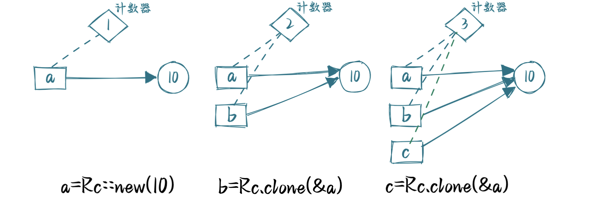
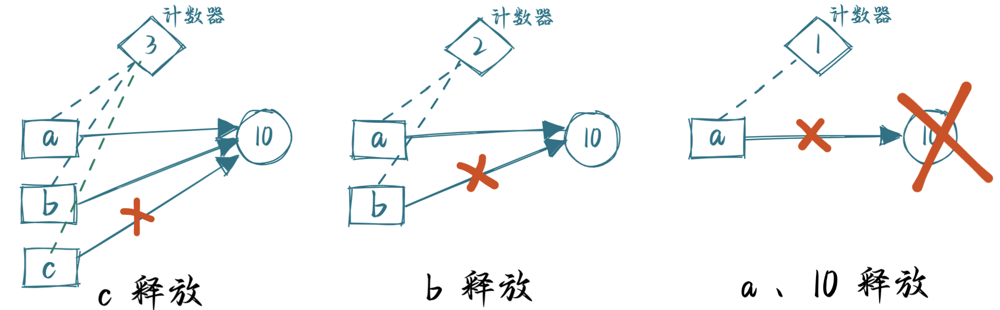

### 智能指针

在各个编程语言中，指针的概念几乎都是相同的：**指针是一个持有内存地址的值，该内存地址引用或者指向了另外的数据**。

智能指针则不然，它虽然也号称指针，但是它是一个复杂的家伙：通过比引用更复杂的数据结构，包含比引用更多的信息，例如元数据，当前长度，最大可用长度等。除了指向数据的指针外，它还有元数据以提供额外的处理能力。

总之，Rust 的智能指针并不是独创，在 C++ 或者其他语言中也存在相似的概念。

#### 引用

Reference 是 Rust 中最常见的指针类型, 其作用即是**借用**并**指向**其所借用的变量的值

引用是一个特殊的指针，它的解引用访问是受限的，只能解引用到它引用数据的类型，不能用作它用。

```rust
let x = 100;
let mut y: i64 = 200;

#[derive(Debug)]
struct A(i32);
let a = A(100);

// 使用 & 获取 不可变引用 / 可变引用
let x_pointer = &x;
let y_pointer = &mut y;
let a_pointer = &a;

println!("{:?}", x_pointer); // 100 打印时会自动 “解引用”到数据，而不是地址 Address
println!("{:p}", x_pointer); // 0x7ff7b9bae33c  如果要打印地址的话，改变占位符? 为 p

// let z = &mut y; // 同一作用域下, 可变借用不能超过1次

y = *y_pointer + 100;  // *解引用后取到值后, 修改

println!("{:?}", y); //300 本条代码结束后，可变借用才释放
println!("{:?}", a_pointer); // A(100)
```


#### 裸指针

裸指针(raw pointer/ primitive type pointer) , 裸指针即原始的、不安全的指针  `*const T 和 *mut T`

裸指针没有所有权和生命周期的概念，也没有自动内存管理的功能。裸指针提供了对内存底层的低级访问能力，因此在一些特定的场景下，裸指针可能会有一些用处。

1. FFI（Foreign Function Interface）：当与其他编程语言进行交互时，特别是调用C语言函数时，裸指针可以用作函数参数或返回值的桥梁。这是因为C语言中广泛使用裸指针作为与内存交互的方式。
2. 与硬件交互：在与底层硬件进行直接交互的情况下，裸指针可以用于读取或写入特定内存地址的数据。这可以包括操作系统开发、嵌入式系统编程等领域。

  (详见 unsafe Rust)

```rust
    let x = 100;
    let mut y: i64 = 200;
    struct B(i32);
    let a = B(100);

    // 裸指针是使用 as *const 从引用转换而来
    let x_raw_pointer = &x as *const i32;
    let y_raw_pointer = &mut y as *const i64;
    let a_raw_pointer = &a as *const B;

    println!("{:?}", x_raw_pointer); // 0x7ff7b763a46c，裸指针打印时不会被“解引用”到数据，而是会直接会打印地址

    unsafe {
        y = *y_raw_pointer + 300; // 裸指针解引用需要使用 unsafe 语法块，这里的解引用的安全的

        let z_raw_pointer = &mut y as *const i64; // 第二次生成可变裸指针，unsafe 块绕过了可变借用的次数规则，是不是感觉有点危险？

        y = *z_raw_pointer + 500; // 然后继续改变数据

        println!("{:?}", *y_raw_pointer); // 1000
    }
    println!("{:?}", a_raw_pointer); // 0x7ff7b763a47c
    println!("{:?}", y); // 1000
/*
0x7ffed14219c4
1000
0x7ffed14219d4
1000       */
```


#### 智能指针

在 Rust 中，

1. 凡是需要做**资源回收**的数据结构，
2. 且实现了 **Deref/DerefMut**
3. 且实现了 **Drop**，都是智能指针。

- `Deref` 允许自动解引用, 让智能指针**像引用那样工作**，这样你就可以写出同时支持智能指针和引用的代码，例如泛型  `*T`
- `Drop` 允许你指定智能指针超出作用域后自动执行的代码，例如做一些数据清除等允许自动释放资源的收尾工作

按照这个定义，`String` 和 `Vec` 是智能指针，用于在堆上分配内存的 `Box<T>` 和 `Vec<T>`、用于引用计数的 `Rc<T>` 和 `Arc<T>` 也都是智能指针


智能指针 和 结构体 有什么区别呢？来看 `String` 是用结构体定义的：

```rust
pub struct String {
    vec: Vec<u8>,
}
```

和普通的结构体不同的是，String 实现了 `Deref` 和 `DerefMut`（后面 Deref 会详细讲），这使得它在**解引用**的时候，会得到 `&str`，看下面的标准库的实现：

```rust
impl ops::Deref for String {
    type Target = str;

    fn deref(&self) -> &str {
        unsafe { str::from_utf8_unchecked(&self.vec) }
    }
}

impl ops::DerefMut for String {
    fn deref_mut(&mut self) -> &mut str {
        unsafe { str::from_utf8_unchecked_mut(&mut *self.vec) }
    }
}
```


另外，由于在堆上分配了数据，String 还需要为其分配的资源做相应的回收。而 String 内部使用了 Vec，所以它可以依赖 Vec 的能力来释放堆内存。下面是标准库中 Vec 的 `Drop trait` 的实现：

```rust
unsafe impl<#[may_dangle] T, A: Allocator> Drop for Vec<T, A> {
    fn drop(&mut self) {
        unsafe {
            // use drop for [T]
            // use a raw slice to refer to the elements of the vector as weakest necessary type;
            // could avoid questions of validity in certain cases
            ptr::drop_in_place(ptr::slice_from_raw_parts_mut(self.as_mut_ptr(), self.len))
        }
        // RawVec handles deallocation
    }
}
```


### Drop Trait

在一些无 GC 语言中，程序员在一个变量无需再被使用时，需要手动释放它占用的内存资源，如果忘记了，那么就会发生内存泄漏，最终臭名昭著的 `OOM (Out of Memory)` 问题可能就会发生。

而在 Rust 中，你可以指定在一个变量超出作用域时，执行一段特定的代码，最终编译器将帮你自动插入这段收尾代码。这样，就无需在每一个使用该变量的地方，都写一段代码来进行收尾工作和资源释放 (`Drop` Trait)

```rust
// 2.3 Drop trait 如何起作用的？
// 当一个值离开作用域时，它的 drop 方法会被自动被编译器调用，无需手动调用，强行手动调用编译器会报错

#[derive(Debug)]
struct User {
    name: String,
    age: u32,
}

impl Drop for User {  // override 其原来的实现
    fn drop(&mut self) {
        println!("{:?}", "rust")  // 源代码会做复杂的释放工作，这里演示只是做了打印
    }
}

let mut user = User {
    name: "rust".to_string(),
    age: 12,
};

// user.drop(); //手动调用也行, 但是因为编译器会自动调用，显式调用二者会冲突

// 你会在终端发现打印了 “Rust”，成功验证，编译器确实调用了 drop
```


📢 : `Copy trait` (栈上浅拷贝) 和 `Drop trait` 是互斥的

> 由于 `Copy` trait 和 `Drop` trait 在类型的复制和销毁行为上有不同的语义，它们是互斥的。
>
> 如果一个类型实现了 `Copy` trait，意味着它是一种可以通过简单的位拷贝复制的类型，不需要执行特殊的析构操作。因此，这样的类型不需要实现 `Drop` trait。离开作用域时，他们的栈空间会被自动回收，没有任何附加的清理工作需要做。
>
> 相反，如果一个类型实现了 `Drop` trait，意味着它拥有一个特殊的析构函数，并需要在值被销毁时执行一些清理操作。这样的类型不能实现 `Copy` trait，因为位拷贝复制无法触发析构函数的调用。


### Deref Trait

Deref 即解引用，`std::ops::Deref;` 对应的操作符是 `*` ， `*` 操作符会触发类型的 `deref()` 方法。

```rust
    use std::ops::Deref;

    #[derive(Debug)]
    struct MyBox<T>(T);

    impl<T> Deref for MyBox<T> { // 实现 Deref trait
        type Target = T;
        fn deref(&self) -> &T {
            &self.0
        }
    }

    {
        let m = MyBox("rust");
        let ref_my_box = *m; // 实现了 Deref trait的智能指针可以使用 * 直接解引用到 &self.0

        // String 是智能指针，它实现了 Deref trait，所以可以直接解引用

        fn take_ref_string(s: &str) { // 需要一个 &str 类型
            println!("{:?}", s)
        }

        // 将 String 解引用为 str
        // 注意：String这个智能指针包裹的类型是 str，解引用后大小编译器无法确定，所以要再加&（引用）
        let s = String::from("Rust"); //String
        take_ref_string(&s); // 需要一个 &str 类型， 传入了 &String： 自动 Deref
    }
```


#### `Box<T>` 中的 Deref：自动引用、解引用

> `Box<T>` 允许你将值分配到堆 (heap) 上，然后在栈上保留一个智能指针指向堆上的数据。


一些自动引用 + 自动解引用的例子：

- 当我们使用`.`运算符来调用方法时，编译器会自动为我们创建一个引用。
- 当我们使用`*`运算符来解引用一个值时，编译器会自动为我们创建一个引用或可变引用

```rust
#![allow(unused)]
fn main(){
    let s = String::from("hello");

    s.len();     // 自动引用: 传入了 String，但 len() 需要 &String，编译器自动引用成 &String
    (&s).len();  // 手动引用
 
  
    let s = Box::new(String::from("hello"));

    s.len();    // 自动解引用: Box<String> Deref 成 &String （len 函数需要 &String）
    (*s).len(); // 手动解引用: 手动将 Deref 出的 &String 解引用成 String，然后 Rust 自动添加引用
}
```


[Box<T> Deref 实现](https://doc.rust-lang.org/src/alloc/boxed.rs.html#1884)

```rust
#[stable(feature = "rust1", since = "1.0.0")]
#[rustc_const_unstable(feature = "const_box", issue = "92521")]
impl<T: ?Sized, A: Allocator> const Deref for Box<T, A> {
    type Target = T;  // 这个 Deref 想将 Box<T> 转换成 T，即把内部类型展示出来

    fn deref(&self) -> &T {
        &**self  // *self 会获取 Box 的值，再次 * 解引用会获取到 Box 指向的值 T，而最外层的 & 又将其取为引用
    }
}
```

这样，当你有一个 `Box<T>` 类型的值时，你可以直接调用其内部 `T` 类型的方法（比如 `s.len()` ），而无需手动解引用。

Rust 编译器会自动帮你调用 `deref` 方法进行解引用，这就是自动解引用（Deref coercion）。


来看看 `Vec<Box<i32>>` 的内存布局来理解代码里的 `&**self`：

- `self` 即栈上的指向 `Box` 值的引用
- `*self` 即 Box 的值
- `**self` 即 Box 所指向的 `T` 类型的值
- `&**self` 即取 `T` 值的引用即 `&T`

```rust
                    (heap)
(stack)    (heap)   ┌─────────┐
┌──────┐   ┌───┐ ┌─→│ "hello" │
│ vec2 │──→│B1 │─┘  └─────────┘
└──────┘   ├───┤    ┌───┐
           │B2 │───→│ 2 │
           ├───┤    └───┘
           │B3 │─┐  ┌───┐
           ├───┤ └─→│ 3 │
           │B4 │─┐  └───┘
           └───┘ │  ┌───┐
                 └─→│ 4 │
                    └───┘
}
```


####  `*` 背后的原理

当我们对智能指针 `Box` 进行解引用时，实际上 Rust 为我们调用了以下方法：

```rust
*(y.deref())  // *(s.deref())
```

首先调用 `deref` 方法返回值的常规引用，然后通过 `*` 对常规引用进行解引用，最终获取到目标值。

至于 Rust 为何要使用这个有点啰嗦的方式实现，原因在于所有权系统的存在。如果 `deref` 方法直接返回一个值，而不是引用，那么该值的所有权将被转移给调用者，而我们不希望调用者仅仅只是 `*T` 一下，就拿走了智能指针中包含的值。


来看一个 `*` 解引用后，所有权发生转移的例子：

```rust
fn main(){
    let s = Box::new("Rusting".to_string());  // 
    let t = *s;    // *(s.deref()) -> *(&**&s)
                   //这里我们获取了 x 中的值的所有权, String 没实现 Copy, Move 语义生效
    println!("{}", t);  // Rusting
    // println!("{}", s); // ❌ Error ^ value borrowed here after move
}
```

其内存布局：

```
(stack)    (heap)    (heap)
┌─────┐   ┌────┐   ┌───────────┐
│  s  │──→│Box │──→│ "Rusting" │
└─────┘   └────┘   └───────────┘
                         ↑
                      ┌─────┐
                      │  t  │
                      └─────┘
```

发生了什么：

1. `*s`  即 `*(s.deref())`  语义上等价于 `*(&**&s)` 
   1. `&s` 即栈上的指针，`*&s` 即 Box 的值，`**&x` 即 Box 所指向的 “Rusting” 的值，`(&**&s)` 即指向“Rusting” 的引用，这也正是 `s.deref()`  所返回的东西
   2. 对 `s.deref()` 解引用：`*(s.deref())` 即解引用这个“指向“Rusting” 的引用” 即 "Rusting" 本身
2. `let t = *s;` 即将 "Rusting" String 本身 Move 给 t （"Rusting" 这个 String 类型没有实现 Copy Trait，所以 Move 语义生效）


### `Box<T>`

`Box<T>`，它是 Rust 中最基本的在堆 (heap) 上分配内存的方式，绝大多数其它包含**堆内存分配**的数据类型，内部都是通过 `Box<T>` 完成的，比如 `Vec<T>`。

`Box<T>` 允许你将值分配到堆 (heap) 上，然后在栈上保留一个智能指针指向堆上的数据。


如果一个变量拥有一个数值 `let a = 3`，那变量 `a` 必然是存储在栈上的，那如果我们想要 `a` 的值存储在堆上就需要使用 `Box<T>`：

```rust
fn main() {
    let a = Box::new(3);
    println!("a = {}", a); // a = 3, 隐式  `Deref`  对 引用 a 解引用

    // 下面一行代码将报错: 表达式中无法自动解引用
    // let b = a + 1; // cannot add `{integer}` to `Box<{integer}>`
}
```

这样就可以创建一个智能指针 , 指向存储在堆 (heap) 上的 `3`，并且 `a` 持有了该指针。智能指针往往都实现了 `Deref` 和 `Drop` 特征，因此：
-   `println!` 可以正常打印出 `a` 的值，是因为它隐式地调用了 `Deref` 对智能指针 `a` 进行了解引用
-   最后一行代码 `let b = a + 1` 报错，是因为在**表达式(expression)** 中，我们无法自动隐式地执行 `Deref` 解引用操作，你需要使用 `*` 操作符 :  `let b = *a + 1`，来显式的进行解引用
-   `a` 持有的智能指针将在作用域结束（`main` 函数结束）时，被释放掉，这是因为 `Box<T>` 实现了 `Drop` 特征

这个例子在实际代码中不太会存在，将一个简单类型分配到堆上并没有太大的意义。不如其自动被分配在栈上，由于寄存器、CPU 缓存的原因，它的性能将更好，而且代码可读性也更好。


#### Box 内存布局

如果数组中每个元素都是一个 `Box` 对象呢？  来看看 `Vec<Box<i32>>` 的内存布局：

```rust
                    (heap)
(stack)    (heap)   ┌───┐
┌──────┐   ┌───┐ ┌─→│ 1 │
│ vec2 │──→│B1 │─┘  └───┘
└──────┘   ├───┤    ┌───┐
           │B2 │───→│ 2 │
           ├───┤    └───┘
           │B3 │─┐  ┌───┐
           ├───┤ └─→│ 3 │
           │B4 │─┐  └───┘
           └───┘ │  ┌───┐
                 └─→│ 4 │
                    └───┘
}
```

上面的 `B1` 代表被 `Box` 分配到堆 (heap) 上的值 `1`。

可以看出智能指针 `vec2` 依然是存储在栈上，然后指针指向一个**堆**上的数组，该数组中每个元素都是一个 `Box` 智能指针，最终 `Box` 智能指针又指向了存储在堆上的实际值。

因此当我们从数组中取出某个元素时，取到的是对应的智能指针 `Box`，需要对该智能指针进行解引用，即对原始智能指针进行 2 次解引用, 才能取出最终的值：

```rust
fn main() {
    let arr = vec![Box::new(1), Box::new(2)];
    let (first, second) = (&arr[0], &arr[1]);
    let sum = **first + **second;   // Attention
}
```

以上代码有几个值得注意的点：
-   使用 `&` 借用数组中的元素，否则会报所有权错误
-   表达式不能隐式的解引用(避免代码潜在的错误和歧义)，因此必须使用 `**` 做两次解引用，第一次将 `&Box<i32>` 类型转成 `Box<i32>`，第二次将 `Box<i32>` 转成 `i32`


#### Box::leak

Box 可以强制把任何数据结构创建在堆(heap) 上，然后在栈(stack) 上放一个指针 , 指向这个数据结构，但此时堆内存的生命周期仍然是受控的，跟栈上的指针一致。

`Box::leak()`，顾名思义，它创建的对象，从堆内存上泄漏出去，不受栈内存控制，是一个自由的、生命周期可以**大到和整个进程的生命周期一致**的对象。


所以我们相当于主动撕开了一个口子，**允许内存泄漏**。允许内存泄漏? 这有啥用啊？

其实还真有点用，例如，你可以把一个 `String` 类型，变成一个 `'static` 生命周期的 `&str` 类型：

```rust
fn main() {
   let s = gen_static_str();
   println!("{}", s);
}

fn gen_static_str() -> &'static str{
    let mut s = String::new();
    s.push_str("hello, world");

    Box::leak(s.into_boxed_str())
}
```

在之前的代码中，如果 `String` 创建于函数中，那么返回它的唯一方法就是转移所有权给调用者 `fn move_str() -> String`，而通过 `Box::leak` 我们不仅返回了一个 `&str` 字符串切片，它还是 `'static` 生命周期的！

要知道真正具有 `'static` 生命周期的往往都是编译期就创建的值，例如 `let v = "hello, world"`，这里 `v` 是直接打包到二进制可执行文件中的，因此该字符串具有 `'static` 生命周期，再比如 `const` 常量。

又有读者要问了，我还可以手动为变量标注 `'static` 啊。其实你标注的 `'static` 只是用来忽悠编译器的，但是超出作用域，一样被释放回收。而使用 `Box::leak` 就可以将一个运行期的值转为 `'static`。

----

**使用场景**

光看上面的描述，大家可能还是云里雾里、一头雾水。

那么我说一个简单的场景，**你需要一个在运行期初始化的值，但是希望他可以全局有效，也就是和整个程序活得一样久**，那么就可以使用 `Box::leak`，例如有一个存储配置 (Configuration) 的结构体实例，它是在运行期动态插入内容，那么就可以将其转为全局有效，虽然 `Rc/Arc` 也可以实现此功能，但是 `Box::leak` 是性能最高的。


### `Rc<T>、Arc<T>`

> Reference: Rust 圣经、陈天《Rust 编程第一课》、《Rust Programming》


Rust 所有权机制要求一个值只能有一个所有者，在大多数情况下，都没有问题，但是考虑以下情况：

- 在图数据结构中，多个边可能会拥有同一个节点，该节点直到没有边指向它时，才应该被释放清理
- 在多线程中，多个线程可能会持有同一个数据，但是你受限于 Rust 的安全机制，无法同时获取该数据的可变引用

以上场景不是很常见，但是一旦遇到，就非常棘手，为了解决此类问题，Rust 在所有权机制之外又引入了额外的措施来简化相应的实现：通过引用计数的方式，允许一个数据资源在同一时刻拥有多个所有者。

这种实现机制就是 `Rc` 和 `Arc`，前者适用于单线程，后者适用于多线程。


- **对一个 Rc 结构**进行 `Rc::clone()`，**不会将其内部的数据复制，只会增加引用计数**。
- 而当一个 Rc 结构离开作用域被 `drop()` 时，也只会减少其引用计数，直到引用计数为零，才会真正清除对应的内存。

```rust
use std::rc::Rc;
fn main() {
    let a = Rc::new(10);
    let b = Rc::clone(&a);  // let b = a.clone() 亦可, 只是可读性下降了
    let c = Rc::clone(&a);  // let c = a.clone();
    assert_eq!(3, Rc::strong_count(&a)); 
    assert_eq!(Rc::strong_count(&b), Rc::strong_count(&c))  // all is 3
}
```

上面的代码我们创建了三个 Rc，分别是 a、b 和 c。它们**共同指向堆上相同的数据**，也就是说，堆上的数据有了三个共享的所有者。




在这段代码结束时，c 先 drop，引用计数变成 2，然后 b drop、a drop. 
a drop 后, 引用计数归零，堆上内存也同步被释放




不要被 `clone` 字样所迷惑，以为 copy 都是浅拷贝 & 所有的 `clone` 都是深拷贝。这里的 `clone` **仅仅复制了智能指针并增加了引用计数，并没有克隆底层数据**，因此 `a` 和 `b` 是共享了底层的字符串 `s`，这种**复制效率是非常高**的。当然你也可以使用 `a.clone()` 的方式来克隆，但是从可读性角度，我们更加推荐 `Rc::clone` 的方式。


### `Cell/RefCell`

> Reference: Rust 圣经、陈天《Rust 编程第一课》、《Rust Programming》


#### 内部可变性 interior mutability

**外部可变性** :  当我们用 `let mut ...` 显式地声明一个可变的值，或者，用 `&mut` 声明一个可变引用时，编译器可以在编译时进行严格地检查，保证只有可变的值或者可变的引用，才能修改值内部的数据，这被称作外部可变性（exterior mutability）。这类规则是静态的，在编译时强制执行，是 Rust 防止数据竞争的主要方式。

然而，有时候这些规则可能过于严格，导致某些合法的操作也无法进行。例如，
1. 有时候我们确实需要在已经借用的值上进行修改
2. 或者对**并未声明成 mut 的值或者引用，也想进行修改**，这个值可以得到可变借用，从而修改内部的数据，
3. 或者我们需要创建一种不在编译期检查，只在运行时检查借用规则的数据结构。

这就是内部可变性, 也是 `Cell/RefCell` 的用武之地，它允许你在某种程度上绕过 Rust 的默认借用规则，将可变性的检查从编译时推迟到运行时。

来看一个简单的例子 : 

```rust
use std::cell::RefCell;

fn main() {
    let data = RefCell::new(1); // 看起来不是一个可变变量
    {
        // 获得 RefCell 内部数据的可变借用
        let mut v = data.borrow_mut();
        *v += 1;
    }
    println!("data: {:?}", data.borrow());  // 2
}
```

本例中 : 
 - `data` 是一个  `RefCell`，其初始值为 1。
 - 我们并未将 `data` 声明为可变变量。之后我们可以通过使用 `RefCell` 的 `borrow_mut()` 方法，来获得一个可变的内部引用，然后对它做加 1 的操作。
 - 最后，我们可以通过 `RefCell` 的 `borrow()` 方法，获得一个不可变的内部引用，因为加了 1，此时它的值为 2。

这里为什么要把**获取**和**操作可变借用**的两句代码，用花括号分装到一个作用域下？

因为根据所有权规则，在同一个作用域下，我们**不能同时有活跃的可变借用和不可变借用。** 通过这对花括号暂时将其**隐藏**，我们明确地**缩小了 `data.borrow_mut()` 这个可变借用的生命周期**，不至于和后续的不可变借用冲突。


#### 单线程适用

**`Cell 和 RefCell` 只适用于单线程场景**

`Cell` 和 `RefCell` 在设计之初就是为了处理单线程的内部可变性。这是由 Rust 的内存安全保证和其借用检查器（borrow checker）的设计决定的。为了在编译时期防止数据竞争，Rust 不允许一个可变引用和一个或多个不可变引用同时存在。然而，这种规则在某些情况下可能过于严格，导致在单线程上下文中的一些合法操作也无法进行。于是，`Cell` 和 `RefCell` 应运而生。

`Cell` 和 `RefCell` 的设计目标是在满足 Rust 的借用规则的同时，提供在单线程中修改共享状态的能力。`Cell` 通过提供 `get` 和 `set` 方法实现了对 `Copy` 类型的内部可变性，而 `RefCell` 则通过运行时的借用检查来实现对任意类型的内部可变性。

然而，这种设计并不适用于多线程环境。在多线程环境中，数据竞争的问题更加严重，需要更严格的同步机制来防止。尝试在多线程环境中使用 `Cell`或 `RefCell` 可能会导致未定义的行为。因此，对于多线程的共享和可变性，Rust提供了其他的并发原语，如 `Mutex`(互斥锁) 和 `RwLock` 等。这些类型内部采用了锁机制，可以在多个线程之间安全地共享和修改数据。

`Cell/RefCell` 使得 Rust 既可以在编译时通过借用检查器防止数据竞争，又可以在必要的时候提供内部可变性，使得我们在编程时既有灵活性，又不会牺牲内存安全。

> 内部可变性的实现是因为 Rust 使用了 `unsafe` 来做到这一点，但是对于使用者来说，这些都是透明的，因为这些不安全代码都被封装到了安全的 API 中


#### RefCell 实例

由于 `Rust` 的 `mutable` 特性，一个结构体中的字段，要么全都是 `immutable`，要么全部是 `mutable`，**不支持针对部分字段进行设置**。比如，在一个 `struct` 中，**可能只有个别的字段需要修改，而其他字段并不需要修改**，为了一个字段而将整个 `struct` 变为 `&mut` 也是不合理的。

所以，实现 **内部可变性** 的 `Cell` 和 `RefCell` 正是为了解决诸如这类问题存在的，通过它们可以实现 `struct` 部分字段可变，而不用将整个 `struct` 设置为 `mutable`。

```rust
use std::cell::Cell;

#[derive(Debug)]
struct Person {
    // 一个人的名字从出生就决定了（不提供后续修改）
    name: String,
    // 而年龄每一年都在变（提供后续修改）
    age: Cell<u8>,
}

fn main() {
    // person 是不可变的
    let person = Person {
        name: "Rustln".to_string(),
        age: Cell::new(30),
    };
     
    // 如下修改代码会 Oops! 出错了 ~ ，因为 person 并没有 mut 声明
    // person.name = "Rustln2022";

    // 哎，又过一年了~~（这里我改变了 age）
    person.age.set(person.age.get() + 1);
    // 哎，又老一岁了~~（这里我又改变了 age）
    person.age.set(person.age.get() + 1);

    println!("{:?}", person);
}
```


#### Rc + RefCell 组合使用

在 Rust 中，一个常见的组合就是 `Rc` 和 `RefCell` 在一起使用，
 - `Rc` 负责实现一个数据拥有多个所有者，
 - `RefCell` 负责实现数据的可变性：

> 由于 `Rc` 只是一个只读的计数器, 无法拿到 Rc 结构内部数据的可变引用来修改数据, 因此需要 `RefCell` 来达成对只读数据的可变借用, 称为内部可变性.  `Rc` 和 `RefCell` 经常搭配使用

```rust
use std::cell::RefCell;
use std::rc::Rc;
fn main() {
    let s = Rc::new(RefCell::new("我很善变，还拥有多个主人".to_string()));

    let s1 = s.clone();
    let s2 = s.clone();
    // let mut s2 = s.borrow_mut();
    s2.borrow_mut().push_str(", on yeah!");

    println!("{:?}\n{:?}\n{:?}", s, s1, s2);
}
/*
RefCell { value: "我很善变，还拥有多个主人, on yeah!" }  
RefCell { value: "我很善变，还拥有多个主人, on yeah!" }  
RefCell { value: "我很善变，还拥有多个主人, on yeah!" }  */
```

上面代码中，我们使用  `RefCell<String>`  包裹一个字符串，同时通过 `Rc` 创建了它的三个所有者： `s`、`s1`  和  `s2`，并且通过其中一个所有者 `s2` 对字符串内容进行了修改。

由于 `Rc` 的所有者们共享同一个底层的数据，因此当一个所有者修改了数据时，会导致全部所有者持有的数据都发生了变化。 执行结果如上 , 所有的字符串里都被插入了 "oh yeah!" 


#### Cell/RefCell 区别

`Cell<T>` 提供了 `get` 和 `set` 方法，它允许在不违反 Rust 借用规则的情况下，在多个不可变引用之间共享和修改内部数据。

`Cell` 是一个简单的类型，可以存储一个单一的值。它可以在不使用 `mut` 关键字标识的可变引用的情况下，对其内部的值进行修改。但是， `Cell` 通常用来存储实现了 `Copy` trait 的类型 (因为 `get` 方法的内部实现是实际上是返回了存储在 `Cell` 中的值的 `copy()` 副本)。


`RefCell<T>`  可以对于没能实现 `Copy` trait 的复杂类型使用  `RefCell`  也提供内部可变性 (interior mutability)。它允许在运行时检查借用规则（即借用检查器），而不是在编译时。它提供了 `borrow` 和 `borrow_mut` 方法来获取内部数据的不可变和可变引用。 

`RefCell` 在运行时检查借用规则，如果违反了规则，就会导致程序崩溃。


### PhantomDate

PhantomData，声明中不直接使用，但在实现过程中需要用到的类型；

思考一下:  现在要设计一个 `User` 和 `Product` 数据结构，它们都有一个 `u64` 类型的 `id`。
然而我希望每个数据结构的 `id` 只能和同种类型的 `id` 比较，也就是说如果` user.id `和 `product.id` 比较，编译器就能直接报错，拒绝这种行为。该怎么做呢？

```rust
use std::marker::PhantomData;

#[derive(Debug, Default, PartialEq, Eq)]
pub struct Identifier<T> {
    inner: u64,
    _tag: PhantomData<T>, // PhantomData<T>
}

#[derive(Debug, Default, PartialEq, Eq)]
pub struct User {
    id: Identifier<Self>,  // Identifier<User>
}

#[derive(Debug, Default, PartialEq, Eq)]
pub struct Product {
    id: Identifier<Self>, // Identifier<Product>
}

#[cfg(test)]
mod tests {
    use super::*;

    #[test]
    fn id_should_not_be_the_same() {
        let user = User::default();       // Default trait 的 default()
        let product = Product::default(); // Default trait 的 default()

        // 两个 id 不能比较，因为他们属于不同的类型
        // assert_ne!(user.id, product.id);

        assert_eq!(user.id.inner, product.id.inner);
    }
}
```

`User::default()` 来创建一个新的 `User` 实例，其字段 `id` 将被初始化为 `Identifier::default()`。

在定义数据结构时，对于额外暂时不需要的**泛型参数**，用 PhantomData 来“拥有”它们，这样可以规避编译器的报错。

`PhantomData` 正如其名，它实际上长度为零，是个 `ZST`（Zero-Sized Type），就像不存在一样，唯一作用就是类型的标记。
